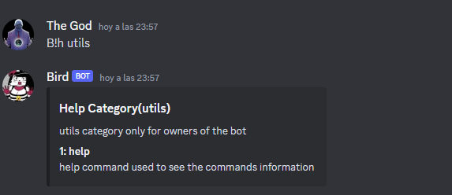

<h3 align="center">Simple Template Discord Bot</h3>

<div align="center">

</div>

---

<p align="center"> A Simple Template for a discord bot
    <br> 
</p>

# Installing

First install all of the dependencies

```bash
npm install
```

then in the file example.env put the token of your bot and the id and prefix of the bot

```env
TOKEN="Token"
BOTOWNER="ID"
PREFIX="prefix"
```

then finally use npx nodemon or tsc an then node dist/index.js to start the bot

## What contain

the template have a simple command handler and event handler all using typescript in the structure slashCommands,Events and Commands you have a simple example of how to use and the function of the handler

## Commands

here is a list of the default commands that you can use



